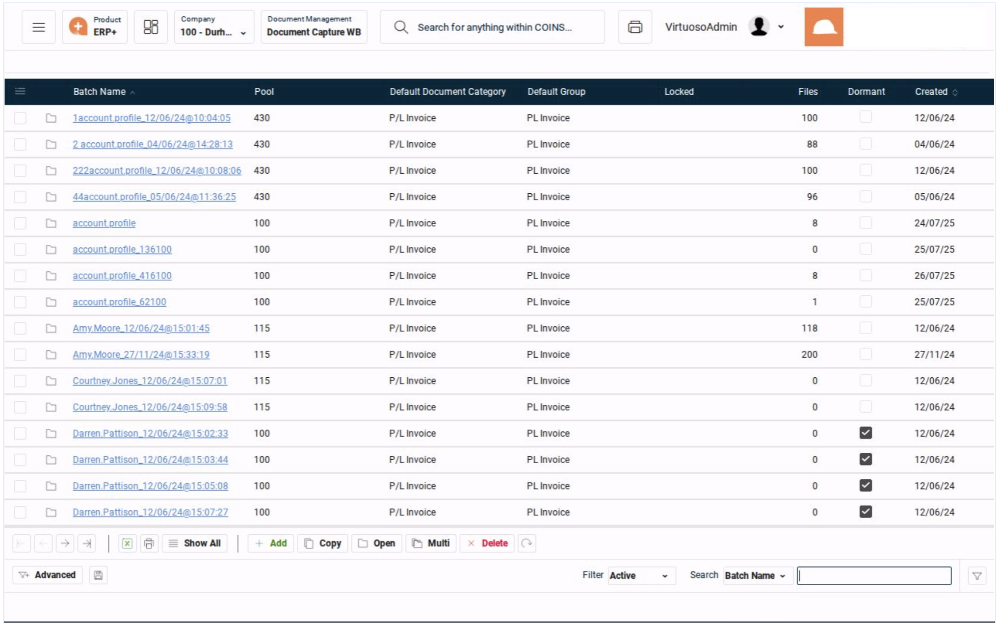
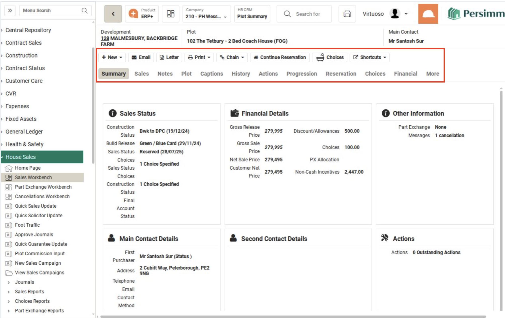

# COINS Iframe Visual Examples - Real Screenshots

## 🖼️ Understanding COINS Frame Structure Through Real Examples

This guide shows actual COINS screenshots to help you identify which iframe pattern to use.

---

## 1. Basic getFrame Pattern (Most Common - 85% of cases)

### Example: Document Capture Workbench - Batch List


**What you see:**
- Simple grid/table layout
- Basic action buttons at bottom (Add, Copy, Open, etc.)
- NO search fields above the table
- Standard "Show All" navigation at bottom

**When to use:** `SYS: Switch to getFrame`

**Visual Indicators:**
- ✅ Plain table/grid
- ✅ No filter/search boxes above grid
- ✅ Standard buttons at bottom
- ❌ No "Search:" field visible above table

---

## 2. getFrame with Tabs Pattern

### Example: House Sales - Plot Details View


**What you see:**
- Multiple tabs (Summary, Sales, Notes, Plot, etc.)
- Detailed form view (not a grid)
- Command bar with action buttons (New, Email, Letter, Print, etc.)
- Rich content area with multiple sections

**When to use:** `SYS: Switch to getFrame`

**Visual Indicators:**
- ✅ Tab navigation present
- ✅ Form/detail view (not grid)
- ✅ Command bar with actions
- ❌ Still no search fields above content

---

## 3. Inline Frame Pattern (Empty Grid State)

### Example: Document Capture - Empty Batch


**What you see:**
- Empty grid with column headers
- Tab navigation (Batch Maint, Auto Index, Upload)
- Grid is ready but contains no data
- Action buttons below grid

**When to use:** `SYS: Switch to getFrame` (even though it's an inline frame)

**Visual Indicators:**
- ✅ Empty grid state
- ✅ Column headers visible
- ❌ No search capability above grid
- 📝 Note: This is still treated as basic getFrame

---

## 4. Active Inline Frame Pattern (Complex Grid - 10% of cases)

### Example: House Sales - Sales Workbench with Search


**What you see:**
- **🔍 SEARCH FIELD at bottom right** ("Search: Surname" with input box)
- Filter tabs at top (By Development, By Purchaser, By Provisional)
- Advanced Search option
- Grid with customer/purchaser data
- Can actively search/filter the grid content

**When to use:** `SYS: Switch to getFrame + active inlineframe`

**Visual Indicators:**
- ✅ **Search/filter capability** (See "Search: Surname" field at bottom)
- ✅ Filter tabs present at top
- ✅ Advanced Search link
- ✅ Grid has interactive filtering
- ✅ More complex grid with search functionality

---

## 🎯 Quick Decision Guide

Look at your COINS screen and ask:

### "Can I search/filter the grid data?"

```
┌─────────────────────────────────────────────────────────┐
│                                                          │
│  Is there any search/filter functionality?              │
│  (Check top AND bottom of the grid)                     │
│                                                          │
│  YES → Use: getFrame + active inlineframe               │
│       (Like Sales Workbench with "Search: Surname")     │
│                                                          │
│  NO  → Use: getFrame                                    │
│       (Like Document Capture examples)                  │
│                                                          │
└─────────────────────────────────────────────────────────┘
```

---

## 📋 Visual Checklist

| Screen Element | Basic getFrame | Active Inline Frame |
|----------------|----------------|---------------------|
| Grid/Table | ✅ Yes | ✅ Yes |
| Action buttons | ✅ Bottom only | ✅ Multiple locations |
| Search functionality | ❌ No | ✅ Yes (anywhere on page) |
| Filter tabs | ❌ No | ✅ Yes (By Development, etc.) |
| "Advanced Search" | ❌ No | ✅ Yes |
| Can filter/search data | ❌ No | ✅ Yes |
| "Search:" field visible | ❌ No | ✅ Yes (bottom right in example) |

---

## 💡 Pro Tips

1. **Don't overthink it** - If you can search above the grid, use active inline frame. Otherwise, use basic getFrame.

2. **Tabs don't matter** - Having tabs (like in example 2) doesn't change the pattern. Only the search field matters.

3. **Empty grids** - Even if a grid is empty (example 3), use the same pattern as if it had data.

4. **When in doubt** - Try basic getFrame first. It works 85% of the time.

---

## 🚨 Common Mistakes

1. **Mistake**: Using active inline frame just because you see a grid
   - **Fix**: Only use it if there's a search field above the grid

2. **Mistake**: Switching frames when you see tabs
   - **Fix**: Tabs don't require special frame handling

3. **Mistake**: Manual frame switching
   - **Fix**: Always use library checkpoints like `SYS: Switch to getFrame`

---

## Next Steps

- For dialog/popup handling, see [Dialog Frame Patterns](./COINS_IFRAME_DIALOG_PATTERNS.md)
- For error handling, see [Error Recovery Guide](./COINS_IFRAME_ERROR_HANDLING_GUIDE.md)
- For module-specific patterns, see [Module Adaptive Logic](./COINS_MODULE_ADAPTIVE_LOGIC.md)