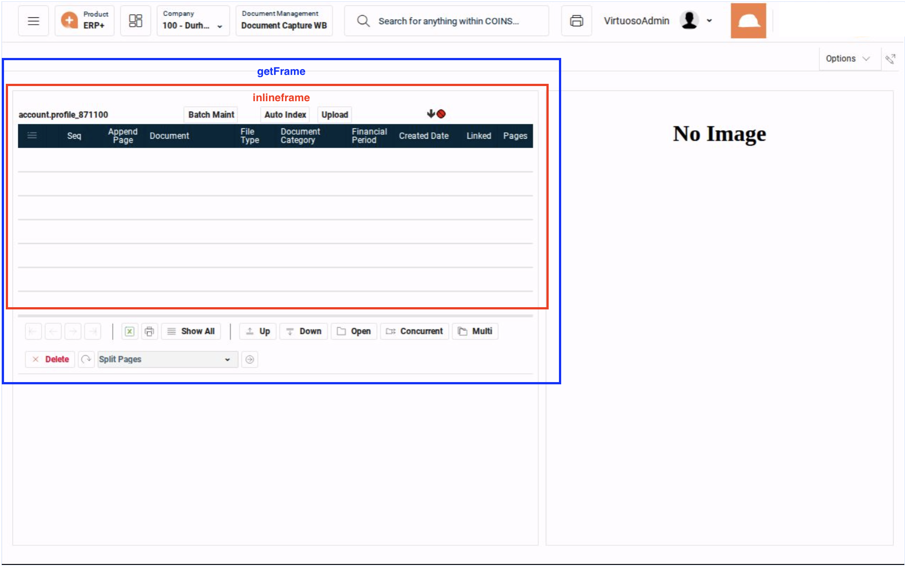
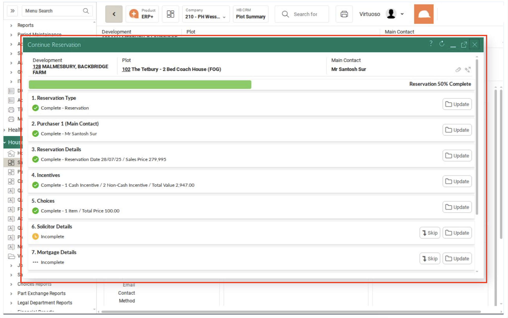

# COINS Iframe Visual Examples - Simplified Guide

## 🖼️ One Example Per Frame Type

This guide shows the three main iframe patterns you'll encounter in COINS.

---

## 1. Basic getFrame Pattern (85% of cases)

### Example: General Ledger Grid


**What you see:**
- Standard grid with data
- Search field at bottom ("Search: Development.Plot")
- Navigation controls (Advanced, Filter All)
- Standard COINS layout

**When to use:** `SYS: Switch to getFrame`

**Key Point:** Even though there's a search field, this still uses basic getFrame!

---

## 2. Inline Frame Pattern (10% of cases)

### Example: Document Capture with Tabs


**What you see:**
- Blue border labeled "getFrame" (outer frame)
- Red border labeled "inlineframe" (inner frame)
- Tab navigation (Batch Maint, Auto Index, Upload)
- Grid area inside the nested frames
- Visual proof of the two-layer structure

**When to use:** First `SYS: Switch to getFrame` THEN `SYS: Switch to inlineframe`

**Key Point:** The colored borders show exactly why you need TWO frame switches - you must navigate through getFrame (blue) to reach inlineframe (red).

---

## 3. Active Inline Frame Pattern (Sales Workbench - Special Case)

### Example: Sales Workbench with Search


**What you see:**
- Filter tabs at top (By Development, By Purchaser, By Provisional)
- Search field at bottom right ("Search: Surname")
- Advanced Search option
- Customer/purchaser data grid

**When to use:** `SYS: Switch to getFrame + active inlineframe`

**Key Point:** This is a special pattern mainly for Sales Workbench - requires the combined checkpoint.

---

## 4. Dialog Frame Pattern (Popups/Modals)

### Example: Continue Reservation Modal


**What you see:**
- Popup window with green title bar
- Window controls (minimize, maximize, refresh, help, close buttons)
- Multi-step form (1. Reservation Type, 2. Purchaser, etc.)
- Draggable/resizable window (notice resize handles)
- NOT a full-page overlay

**When to use:** `SYS: Switch to Dialog Frame`

**Key Point:** Look for the green title bar with window controls - this indicates a COINS dialog frame.

---

## 🎯 Simple Decision Flow

```
START
  │
  ▼
Is it a popup with green title bar?
  │
  ├─ YES → Use: SYS: Switch to Dialog Frame
  │
  └─ NO → Continue
           │
           ▼
         Is it Sales Workbench with search?
           │
           ├─ YES → Use: SYS: Switch to getFrame + active inlineframe
           │
           └─ NO → Try: SYS: Switch to getFrame
                     │
                     ├─ WORKS → Done! (85% of cases)
                     │
                     └─ ERROR → Add: SYS: Switch to inlineframe
```

---

## 💡 Key Takeaways

1. **Start Simple** - Always try `getFrame` first (85% success rate)
2. **Green Title Bar = Dialog Frame** - Window controls are the key indicator
3. **Sales Workbench is Special** - Uses the combined active inlineframe pattern
4. **Two-Step Pattern** - Some grids need getFrame THEN inlineframe
5. **Visual Cues Matter** - Look for specific UI elements, not just any search field

---

## 📋 Quick Reference

| Pattern | Visual Clue | Checkpoint to Use |
|---------|-------------|-------------------|
| Standard Grid | Regular table/form, even with search | `SYS: Switch to getFrame` |
| Nested Content | Tabs with frame borders visible | `SYS: Switch to getFrame` + `SYS: Switch to inlineframe` |
| Sales Workbench | Filter tabs + search field | `SYS: Switch to getFrame + active inlineframe` |
| Modal/Popup | Green title bar with window controls | `SYS: Switch to Dialog Frame` |

That's it! Four patterns cover everything in COINS.