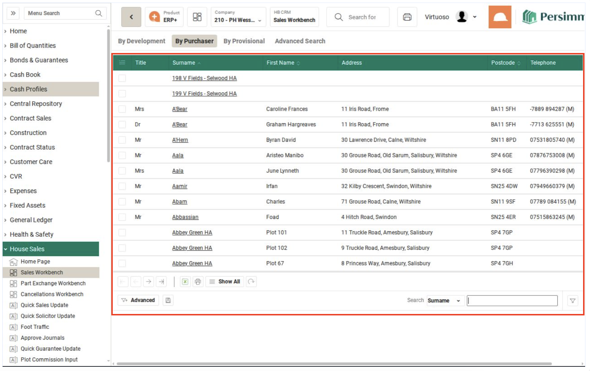
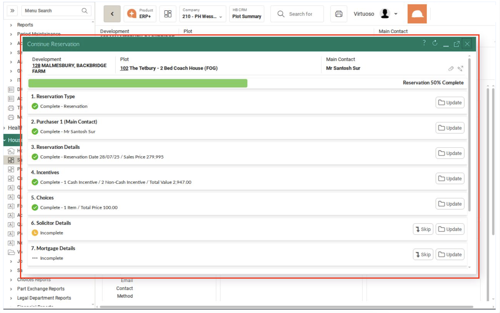
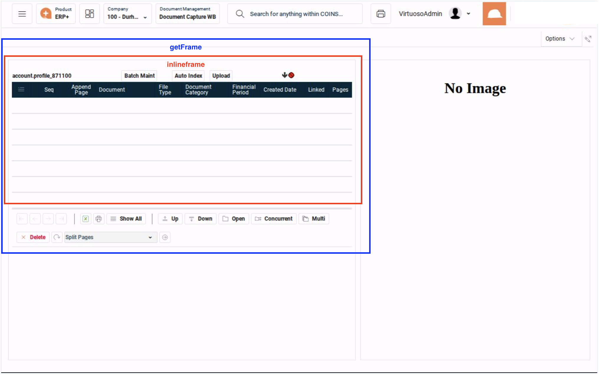

# COINS Navigation Guide for Business Users

## Welcome! 🎯

When using COINS, you're navigating through different "frames" - think of them like rooms in a house. Sometimes you need to tell the system which room you're in before it can help you. Good news: **85% of the time, it's the same simple pattern!**

This guide will show you exactly what to look for and which navigation pattern to use.

---

## 🟢 The Standard Pattern (What You'll Use 85% of the Time)

### What You'll See:


This is a typical COINS screen showing:
- A data grid with information
- Standard COINS header and navigation
- Search field at the bottom (yes, even with search it's still the standard pattern!)
- Filter and navigation controls

### The Simple Rule:
**When you see a standard COINS screen → Use: `SYS: Switch to getFrame`**

### Where You'll Use This:
- ✅ General Ledger (GL)
- ✅ Payroll (PR) 
- ✅ Human Resources (HCM)
- ✅ Subcontract (SC)
- ✅ Most day-to-day COINS operations

**Remember**: Even if you see a search field, start with this standard pattern!

---

## 🔵 Special Case #1: Sales Workbench

### What You'll See:


The Sales Workbench is special. Look for:
- **Filter tabs at the top** (By Development, By Purchaser, By Provisional)
- **Search field at the bottom right**
- Customer/purchaser data in a grid format

### The Rule:
**When in Sales Workbench → Use: `SYS: Switch to getFrame + active inlineframe`**

### Where You'll Find This:
- 🏠 House Sales - Sales Workbench
- 💰 Purchase Ledger (most operations)
- 📋 Purchase Orders (complex grids)
- 📊 Some financial modules with complex grids

---

## 🟣 Special Case #2: Popup Windows

### What You'll See:


Popup windows are easy to spot:
- **Floating window** that appears over your main screen
- Has its own title bar
- Can usually be moved around or closed with an X
- The main screen behind might be dimmed

### The Rule:
**When you see a popup window → Use: `SYS: Switch to Dialog Frame`**

### Common Examples:
- "Continue Reservation" windows
- "Add New Record" popups
- Date pickers
- Lookup windows

---

## 🟡 Special Case #3: Parent Frame Navigation (Warning Dialogs)

### What You'll See:


The screenshot shows a Payroll Employee Maintenance screen with a "Warning" dialog popup. The complex frame structure is highlighted with colored borders:
- **Blue border** = Mainarea (outer frame) - encompasses the entire employee details page
- **Red border** = getFrame (middle frame) - contains the pension records grid
- **Purple border** = Warning dialog (what you need to access) - the popup with "Delete this record? Deletion is permanent and cannot be undone" message and OK/Cancel buttons

When you see warning dialogs or confirmation popups like this:
- "Delete this record? Deletion is permanent and cannot be undone"
- OK/Cancel buttons in a warning box
- System confirmation messages

### The Rule:
**To access the OK button → Use: `SYS: Switch to parent iframe (2x)`**

This navigates "up" through the frame hierarchy:
1. From getFrame → up to mainarea
2. From mainarea → up to the dialog level

### Visual Breadcrumb:
```
You are here: getFrame
    ↑ Switch to parent iframe (1st time)
mainarea
    ↑ Switch to parent iframe (2nd time)
Dialog level (can now click OK)
```

### Common Examples:
- ⚠️ Delete confirmation dialogs
- ✓ Save confirmation messages
- ❌ Error dialog boxes
- 🔒 Permission warnings

---

## 🟠 Advanced Pattern: Nested Frames (Rare - 5% of cases)

### What You'll See:


Sometimes COINS uses frames within frames (like a room within a room). The colored borders in this image show:
- **Blue border** = First frame (getFrame)
- **Red border** = Second frame (inlineframe)

You'll recognize this by:
- Tab navigation (Batch Maint, Auto Index, Upload)
- Content that seems "nested" inside another section

### The Rule:
**Two-step process:**
1. First: `SYS: Switch to getFrame`
2. Then: `SYS: Switch to inlineframe`

---

## 🎯 Quick Decision Guide

Here's how to choose the right pattern:

```
Is it a popup/floating window?
    ↓
    YES → Is it a warning/confirmation dialog?
         ↓
         YES → Use: Switch to parent iframe (2x)
         ↓
         NO → Use: Dialog Frame
    ↓
    NO → Continue...
         ↓
         Is it Sales Workbench (with filter tabs + search)?
             ↓
             YES → Use: getFrame + active inlineframe
             ↓
             NO → Use: getFrame (this works 85% of the time!)
```

---

## 📋 Module Quick Reference

| Module | Pattern to Use | How Often It Works |
|--------|---------------|-------------------|
| **Payroll** | Standard (getFrame) | 95% of the time |
| **HR** | Standard (getFrame) | 95% of the time |
| **General Ledger** | Standard (getFrame) | 95% of the time |
| **Sales Workbench** | Special (getFrame + active inlineframe) | Always |
| **Purchase Ledger** | Special (getFrame + active inlineframe) | 85% of the time |
| **All Others** | Start with Standard | 85% of the time |

---

## ⚠️ Common Mistakes to Avoid

### ❌ DON'T assume search fields mean complex patterns
Even though General Ledger has a search field, it still uses the standard pattern!

### ❌ DON'T worry about colors or styling
Every COINS customer can customize colors. Focus on the layout and functionality instead.

### ❌ DON'T overthink it
Start with the standard pattern - it works 85% of the time!

### ✅ DO look for these visual clues:
- Popup windows → Dialog Frame
- Sales Workbench layout → Special pattern
- Everything else → Standard pattern

---

## 💡 Remember

1. **Start Simple** - The standard pattern (getFrame) works most of the time
2. **Look for Visual Clues** - Popups and Sales Workbench are your main exceptions
3. **Don't Panic** - If one pattern doesn't work, try the next one
4. **Practice Makes Perfect** - You'll quickly learn which modules use which patterns

---

## Need More Help?

- For technical details, see the [Technical Documentation](../technical/README.md)
- For module-specific patterns, see the [Module Pattern Guide](../technical/COINS_MODULE_IFRAME_MAPPING.md)

Remember: You've got this! Most of COINS uses the simple pattern, and now you know exactly what to look for in the special cases. 🚀